# OC 桌宠完整架构流程图

```mermaid
flowchart TB
    subgraph 启动["🚀 启动管线"]
        L[launcher.py 看门狗] -->|拉起子进程| M[main.py]
        M -->|初始化 Qt| PM[PetManager]
        PM -->|创建共享 WS| WS[HanakoWSClient]
        PM -->|创建注册表| IR[ItemRegistry + WorkRegistry]
        PM -->|for each enabled agent| PW[PetWindow]
    end

    subgraph 窗口["🪟 窗口系统"]
        direction TB
        PW -->|10 个 mixin 多重继承| IN[InteractionMixin\n鼠标事件/拖拽/抚摸]
        PW -->|行为| BE[BehaviorMixin\n空闲/自言自语/屏幕感知]
        PW -->|动画| AN[AnimationMixin\n呼吸浮动/视线跟随]
        PW -->|对话| CH[ChatMixin\n输入框/语音/发送]
        PW -->|气泡| BU[BubbleMixin\n气泡显示/节流/右键]
        PW -->|音频| AU[AudioMixin\nTTS 口型回调]
        PW -->|语音| VP[VoiceProviderMixin\nTTS/ASR 构建与热切换]
    end

    subgraph 渲染["🎨 渲染系统"]
        direction TB
        AV[AvatarRenderer 抽象] -->|factory.detect_format| L2D[Live2DRenderer\nCubism Native + QOpenGLWidget]
        AV -->|回退| SP[SpriteRenderer\nQLabel + QTimer 帧动画]
        AV -->|已实现| VRM[VRMRenderer\nQWebEngineView + three-vrm]
        L2D -->|加载| MD[miku.model3.json]
        L2D -->|motion| MS[运动系统]
        L2D -->|expression| EM[7 个表情]
    end

    subgraph 运动["🏃 运动系统"]
        PH[PhysicsEngine\n重力/弹跳/惯性] --> MS[MotionStateMachine]
        MT[MouseTracker\n鼠标追踪] -->|注视/跟随/躲闪| MS
        FW[ForegroundWatcher\n前台窗口检测] --> MS
        AL[ActionLinker\n动作联动] --> MS
        BE[BehaviorParams\nidle/walk/模式切换] --> MS
    end

    subgraph 对话["💬 对话引擎"]
        direction TB
        CE[ConversationEngine\n后台线程] -->|出队 msg| PMsg[_process_message]
        PMsg -->|帮助关键词?| Help[返回内置帮助]
        PMsg -->|统一路由| URT[UnifiedToolRouter]
        URT -->|静态能力 15 个| CAP[CapabilityRouter\n问候/设置/切换/屏幕等]
        URT -->|插件工具| PL[ToolExecutor\nNode.js 子进程]
        URT -->|未命中兜底| LLM[LLM 调用]
        LLM -->|HanakoPetAdapter| HA[HarnessAdapter\n读取 identity.md/memory/\nprovider-catalog.json]
        HA -->|API 调用| API[LLM API]
        LLM -->|回复解析| RP[回复文本 + emotion + anim]
        RP -->|TTS 线程池| TTS[EdgeTTS / CosyVoice\n异步合成]
        TTS -->|on_reply 信号| BUBBLE[主线程: 气泡 + 播放 + 口型]
    end

    subgraph 感知["👁️ 感知系统"]
        direction TB
        PC[PerceptionController] -->|tick 30s| TP[TimePerception\n时段判断]
        PC -->|tick 30s| ES[EmotionStateMachine\n情绪衰减/触发]
        PC -->|tick 30s| SP[SchedulePerception\n日程感知]
        PC -->|tick 30s| PP[PetPermissions\n权限开关]
        PC -->|tick 120s| SCR[ScreenPerception\n屏幕截图 + vision LLM]
        SCR -->|分析结果| SCR_E[情绪映射 → 桌宠反应]
        SCR -->|主动对话| PS[ProactiveScheduler\n空闲规则匹配]
        PS -->|5min/15min/30min/60min| PRO[主动消息 → 对话引擎]
    end

    subgraph 养成["🌱 养成系统"]
        direction TB
        PSM[PetStateManager\n每 agent 独立]
        PSM -->|自然衰减| ATTR[hunger/thirst/energy/stamina/mood/health]
        PSM -->|挂起池回流| PD[pending_* 分 tick 消化]
        PSM -->|模式计算| MODE[ill/poor/normal/happy]
        PSM -->|工作模式| WT[WorkTimer]
        IR -->|物品定义| ITEM[7 件默认]
        WR[WorkRegistry] -->|工作定义| WORK[5 种默认]
        MSYS[MissionSystem\n23 个激活任务]
        MSYS -->|每日刷新| MP[MissionPool]
        MSYS -->|事件驱动| MT[MissionTracker\n对话/屏幕/互动/多宠]
        GSYS[GachaSystem\n盲盒]
        SM[PetSaveManager\n~/.oc-pet/saves/\n<agent_id>.json]
    end

    subgraph 多宠["🐾 多宠协作"]
        M4[MultiPetBridge\n后台调度线程]
        M4 -->|事件队列| EVT[6 种事件类型\ncross_pet_chat/reaction\ncollab_care/gift\npet_enter/leave]
        M4 -->|社交事件| SEG[SocialEventGenerator\n30min 冷却]
        M4 -->|注册/注销| REG[register_pet/unregister_pet]
    end

    subgraph 工具["🔧 工具系统"]
        TR[ToolRegistry\n扫描 plugins/ manifest.json]
        TR -->|108 个工具| URT
        TR -->|30s 热刷新| REF[新增/删除无需重启]
        TE[ToolExecutor\nNode.js 子进程\n无 shell 安全]
    end

    subgraph 配置["📋 配置体系"]
        CFG[config.json\nagents/tts/asr/screen\nproactive/memory/window]
        HAC[~/.hanako/agents/<id>/\nidentity.md/ishiki.md\nmemory/provider-catalog]
        ENV[.env\nAPI Key 等敏感信息]
    end

    CFG -->|加载| PW
    HAC -->|读取| HA
    ENV -->|环境变量| HA

    PW -->|右键菜单| MENU[互动/玩法/管理\n对话/行为/喂食/设置]
    PW -->|系统托盘| TRAY[显示/隐藏/穿透/退出]

    PW --> CE
    PW --> PC
    PW -->|set_nurturing| PSM
    PM --> M4
    M4 -->|注册| PW
    CE --> TR
    CE -->|感知上下文| PC

    style 启动 fill:#1a1a2e,color:#eee
    style 窗口 fill:#16213e,color:#eee
    style 渲染 fill:#0f3460,color:#eee
    style 运动 fill:#533483,color:#eee
    style 对话 fill:#2d4059,color:#eee
    style 感知 fill:#227c70,color:#eee
    style 养成 fill:#a13333,color:#eee
    style 多宠 fill:#4a4e69,color:#eee
    style 工具 fill:#22223b,color:#eee
    style 配置 fill:#3a3a3a,color:#eee
```



## 数据流概述

```
用户输入 → 对话引擎 → 统一路由 → (快速路径: 直接返回 / 工具路径: 插件执行 / LLM路径: API调用)
    → TTS 合成 → 主线程信号 → 气泡显示 + 音频播放 + 口型动画

屏幕感知 → 情绪映射 → 主动对话 → 对话引擎 → 同上

空闲计时 → 自言自语调度 → 对话引擎(proactive模式) → 同上

鼠标事件 → 拖拽/抚摸/双击 → 物理引擎(弹跳) / 动画切换

属性衰减(tick) → 模式计算 → 模式变化回调 → 行为/气泡/动画

多宠事件 → 桥接器队列 → 广播/定向 → 目标桌宠对话引擎
```

## 启动顺序

```
launcher.py
  └─ main.py (子进程)
       ├─ QApplication
       ├─ ThemeManager
       ├─ PetManager
       │    ├─ HanakoWSClient (共享)
       │    ├─ ItemRegistry / WorkRegistry (共享)
       │    └─ for each agent:
       │         └─ PetWindow
       │              ├─ renderer (Live2D / Sprite)
       │              ├─ ConversationEngine (后台线程)
       │              ├─ PerceptionController
       │              ├─ PhysicsEngine (16ms 定时器)
       │              ├─ 养成系统 (PetSaveManager+PetStateManager+WorkTimer)
       │              └─ 注册到 MultiPetBridge
       └─ app.exec() (Qt 事件循环)
```